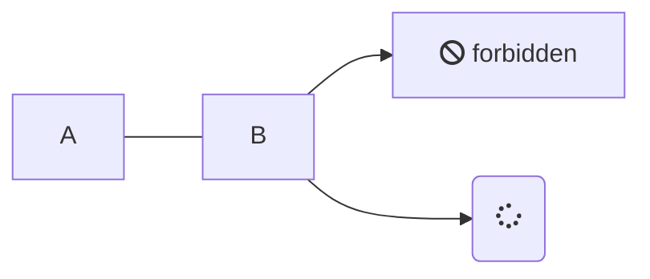
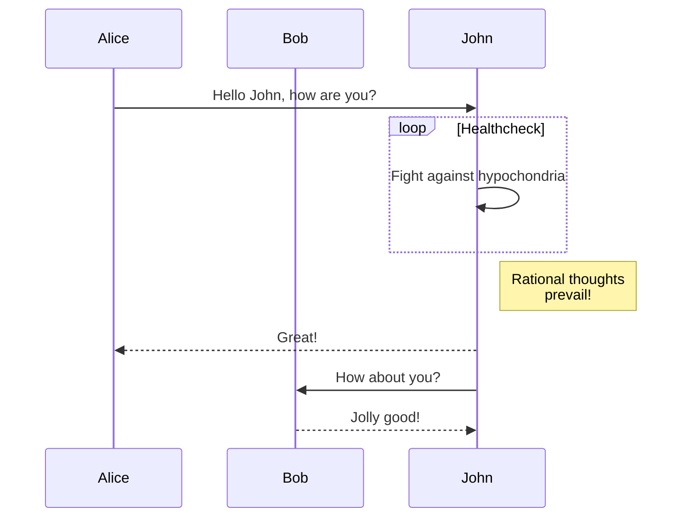
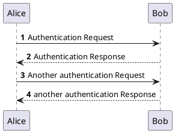

# First test page

## Glossary test 

so what can we found in doitnow


<!-- panels:start -->
<!-- div:title-panel -->

## mermaid sample

<!-- div:left-panel -->



<!-- div:right-panel -->


<!-- panels:end -->

## plant UML sample


## Butifull panel

<!-- panels:start -->
<!-- div:title-panel -->

What about this code


<!-- div:left-panel -->

dfgdfgdf

<!-- div:right-panel -->

<!-- tabs:start -->

### **HTML**

```html
<!-- HTML -->
<h1>Heading</h1>
<p>This is a paragraph.</p>
```

### **JS**

```js
// JavaScript
function add(a, b) {
  return Number(a + b);
}
```

### **CSS**

```css
/* CSS */
body {
  background: white;
}
```
<!-- tabs:end -->

<!-- panels:end -->

## Presented Slides  
<div class="video-container"><iframe src="https://docs.google.com/presentation/d/e/2PACX-1vRnnRFelgw1ksq_p8Eryg3dnyLCRRLPf5fBgdwdv9p-tCIwcxqWvzDGrGbjxGHL7HqEJVpmV26ntk3a/embed?start=false&loop=false&delayms=3000" frameborder="0" width=780" height="585" allowfullscreen="true" mozallowfullscreen="true" webkitallowfullscreen="true"></iframe></div>

## Supplemental Materials  
[Elements of User Experience by Jesse James Garrett](https://qofr.files.wordpress.com/2016/11/q-of-r-presentation-11.pdf)
<div class="responsive-wrap"><iframe src="https://docs.google.com/viewer?url=http://infolab.stanford.edu/pub/papers/google.pdf&embedded=true" style="width:780px; height:585px;" frameborder="0"></iframe></div>

## Handouts
[Course Overview](https://sso.canvaslms.com/courses/1924881/files/folder/Handouts/Course%20Overview)  

## Recommended Reading  
<a class="embedly-card" data-card-controls="0" data-card-align="left" href="https://www.nngroup.com/articles/usability-101-introduction-to-usability/">Usability 101: Introduction to Usability</a>
<script async src="//cdn.embedly.com/widgets/platform.js" charset="UTF-8"></script>
